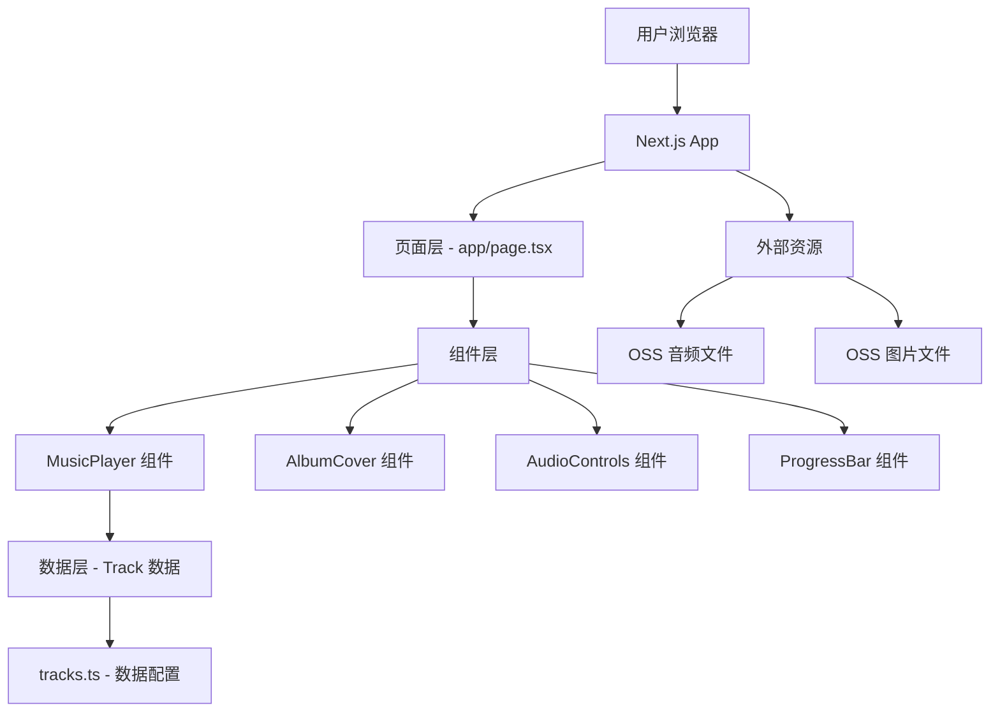

# 设计文档

## 概述

音乐展示网站是一个使用 Next.js 14+ (App Router) 构建的单页应用，采用现代化的音乐播放器界面设计。系统采用组件化架构，将数据层、业务逻辑层和展示层清晰分离，确保未来可以轻松扩展以支持多首歌曲、播放列表等功能。

核心技术栈：
- Next.js 14+ (App Router)
- React 18+
- TypeScript
- Tailwind CSS (样式)
- HTML5 Audio API (音频播放)

## 架构

### 系统架构图



### 分层架构

1. **数据层** (`/lib/data/`)
   - 定义 Track 数据模型
   - 管理音乐曲目配置
   - 提供数据访问接口

2. **业务逻辑层** (`/lib/hooks/`)
   - 自定义 React Hooks 处理音频播放逻辑
   - 状态管理（播放/暂停、进度、音量）
   - 音频事件处理

3. **组件层** (`/components/`)
   - 可复用的 UI 组件
   - 展示逻辑与业务逻辑分离
   - 接收 props 并渲染 UI

4. **页面层** (`/app/`)
   - Next.js App Router 页面
   - 组合组件构建完整页面
   - 处理路由和 SEO

## 组件和接口

### 数据模型

```typescript
// lib/types/track.ts
export interface Track {
  id: string;
  title: string;
  artist: string;
  audioUrl: string;
  coverUrl: string;
  duration?: number; // 可选，秒为单位
}
```

### 核心组件

#### 1. MusicPlayer 组件

主容器组件，协调所有子组件。

```typescript
interface MusicPlayerProps {
  track: Track;
}

export function MusicPlayer({ track }: MusicPlayerProps)
```

**职责：**
- 管理整体布局
- 协调子组件
- 传递 track 数据

#### 2. AlbumCover 组件

显示专辑封面，支持加载状态和错误处理。

```typescript
interface AlbumCoverProps {
  src: string;
  alt: string;
  isPlaying: boolean;
}

export function AlbumCover({ src, alt, isPlaying }: AlbumCoverProps)
```

**职责：**
- 使用 Next.js Image 组件优化图片加载
- 显示加载占位符
- 根据播放状态添加动画效果

#### 3. AudioControls 组件

播放控制按钮（播放/暂停、音量）。

```typescript
interface AudioControlsProps {
  isPlaying: boolean;
  volume: number;
  onPlayPause: () => void;
  onVolumeChange: (volume: number) => void;
}

export function AudioControls({
  isPlaying,
  volume,
  onPlayPause,
  onVolumeChange
}: AudioControlsProps)
```

**职责：**
- 渲染播放/暂停按钮
- 渲染音量控制滑块
- 触发回调函数

#### 4. ProgressBar 组件

显示和控制播放进度。

```typescript
interface ProgressBarProps {
  currentTime: number;
  duration: number;
  onSeek: (time: number) => void;
}

export function ProgressBar({
  currentTime,
  duration,
  onSeek
}: ProgressBarProps)
```

**职责：**
- 显示当前时间和总时长
- 渲染可拖动的进度条
- 处理用户拖动事件

#### 5. TrackInfo 组件

显示歌曲信息（标题、艺术家）。

```typescript
interface TrackInfoProps {
  title: string;
  artist: string;
}

export function TrackInfo({ title, artist }: TrackInfoProps)
```

### 自定义 Hooks

#### useAudioPlayer Hook

封装所有音频播放逻辑。

```typescript
interface UseAudioPlayerReturn {
  isPlaying: boolean;
  currentTime: number;
  duration: number;
  volume: number;
  play: () => void;
  pause: () => void;
  togglePlayPause: () => void;
  seek: (time: number) => void;
  setVolume: (volume: number) => void;
  audioRef: RefObject<HTMLAudioElement>;
}

export function useAudioPlayer(audioUrl: string): UseAudioPlayerReturn
```

**职责：**
- 管理 HTMLAudioElement 引用
- 处理播放状态
- 监听音频事件（timeupdate, ended, loadedmetadata）
- 提供控制方法

### 数据配置

```typescript
// lib/data/tracks.ts
import { Track } from '@/lib/types/track';

export const tracks: Track[] = [
  {
    id: 'nightcall-reverie',
    title: 'Nightcall',
    artist: 'Reverie',
    audioUrl: 'https://oss.ashes.vip/Nightcall%20-%20Reverie.mp3',
    coverUrl: 'https://oss.ashes.vip/Nightcall%20-%20Reverie.jpg',
  },
];

export function getTrackById(id: string): Track | undefined {
  return tracks.find(track => track.id === id);
}

export function getAllTracks(): Track[] {
  return tracks;
}
```

## 数据流

1. **初始化流程：**
   - 页面加载 → 从 `tracks.ts` 获取 Track 数据
   - 传递给 MusicPlayer 组件
   - MusicPlayer 初始化 useAudioPlayer Hook
   - 渲染所有子组件

2. **播放控制流程：**
   - 用户点击播放按钮 → AudioControls 触发 onPlayPause
   - useAudioPlayer 调用 audio.play() 或 audio.pause()
   - 更新 isPlaying 状态
   - 组件重新渲染，更新 UI

3. **进度更新流程：**
   - Audio 元素触发 timeupdate 事件
   - useAudioPlayer 更新 currentTime 状态
   - ProgressBar 组件接收新的 currentTime
   - 进度条视觉更新

4. **拖动进度流程：**
   - 用户拖动进度条 → ProgressBar 触发 onSeek
   - useAudioPlayer 设置 audio.currentTime
   - 音频跳转到指定位置

## 错误处理

### 音频加载错误

```typescript
// 在 useAudioPlayer 中
useEffect(() => {
  const audio = audioRef.current;
  if (!audio) return;

  const handleError = (e: Event) => {
    console.error('音频加载失败:', e);
    // 显示错误提示
    setError('无法加载音频文件，请检查网络连接');
  };

  audio.addEventListener('error', handleError);
  return () => audio.removeEventListener('error', handleError);
}, []);
```

### 图片加载错误

```typescript
// 在 AlbumCover 组件中
<Image
  src={src}
  alt={alt}
  onError={(e) => {
    e.currentTarget.src = '/placeholder-album.png';
  }}
/>
```

### 网络错误处理

- 实现重试机制
- 显示友好的错误消息
- 提供手动重新加载选项

## UI/UX 设计

### 布局设计

采用居中卡片式布局：

```
┌─────────────────────────────────┐
│                                 │
│      ┌─────────────────┐       │
│      │                 │       │
│      │  Album Cover    │       │
│      │   (正方形)       │       │
│      │                 │       │
│      └─────────────────┘       │
│                                 │
│         Song Title              │
│         Artist Name             │
│                                 │
│      ━━━━━━●━━━━━━━━━━         │
│      0:00        3:45           │
│                                 │
│      ⏮  ⏯  ⏭    🔊 ━━●━━      │
│                                 │
└─────────────────────────────────┘
```

### 响应式设计

- **移动端 (< 640px):** 
  - 专辑封面 280px × 280px
  - 垂直堆叠布局
  - 简化控制按钮

- **平板 (640px - 1024px):**
  - 专辑封面 400px × 400px
  - 保持垂直布局
  - 完整控制功能

- **桌面 (> 1024px):**
  - 专辑封面 500px × 500px
  - 可选：横向布局（封面在左，控制在右）
  - 完整功能和动画

### 视觉设计

**配色方案：**
- 主背景：深色渐变 (#0f0f0f → #1a1a1a)
- 卡片背景：半透明白色 (rgba(255, 255, 255, 0.05))
- 主色调：根据专辑封面提取（可选功能）
- 文字：白色 (#ffffff) 和灰色 (#a0a0a0)
- 强调色：蓝色或紫色渐变

**动画效果：**
- 专辑封面：播放时缓慢旋转或脉动效果
- 按钮：hover 时放大和颜色变化
- 进度条：平滑过渡
- 页面加载：淡入动画

### 可访问性

- 所有交互元素支持键盘导航
- 提供 ARIA 标签
- 确保颜色对比度符合 WCAG AA 标准
- 支持屏幕阅读器

## 测试策略

### 单元测试

使用 Jest 和 React Testing Library：

1. **useAudioPlayer Hook 测试：**
   - 测试播放/暂停切换
   - 测试进度更新
   - 测试音量控制
   - 测试错误处理

2. **组件测试：**
   - AudioControls：按钮点击事件
   - ProgressBar：拖动和点击事件
   - AlbumCover：图片加载和错误处理
   - TrackInfo：正确渲染数据

### 集成测试

1. **完整播放流程：**
   - 加载页面 → 点击播放 → 验证音频播放
   - 拖动进度条 → 验证时间跳转
   - 调整音量 → 验证音量变化

2. **错误场景：**
   - 无效音频 URL → 显示错误消息
   - 无效图片 URL → 显示占位符
   - 网络断开 → 显示重试选项

### 端到端测试

使用 Playwright（可选）：

1. 完整用户流程测试
2. 跨浏览器兼容性测试
3. 响应式设计测试

### 性能测试

1. **Lighthouse 指标：**
   - FCP < 1.5s
   - LCP < 2.5s
   - TTI < 3.5s

2. **音频性能：**
   - 测试音频预加载
   - 测试播放延迟
   - 测试内存使用

## 扩展性考虑

### 未来功能支持

当前设计已为以下功能预留扩展空间：

1. **多曲目支持：**
   - tracks 数组已支持多个 Track
   - 可添加 TrackList 组件显示曲目列表
   - 可添加 currentTrackIndex 状态管理当前播放

2. **播放列表：**
   - 扩展 Track 模型添加 playlistId
   - 创建 Playlist 数据模型
   - 添加上一首/下一首功能

3. **用户交互：**
   - 收藏功能
   - 分享功能
   - 评论功能

4. **高级功能：**
   - 歌词显示（LRC 格式）
   - 音频可视化（频谱分析）
   - 播放历史记录
   - 个性化推荐

### 数据持久化

未来可集成：
- 本地存储（localStorage）保存播放进度和偏好设置
- 后端 API 集成用户数据
- 数据库存储曲目信息

### API 设计预留

```typescript
// 未来 API 接口示例
// app/api/tracks/route.ts
export async function GET() {
  const tracks = await fetchTracksFromDatabase();
  return Response.json(tracks);
}

// app/api/tracks/[id]/route.ts
export async function GET(
  request: Request,
  { params }: { params: { id: string } }
) {
  const track = await fetchTrackById(params.id);
  return Response.json(track);
}
```

## 部署考虑

### 静态导出

由于当前版本是纯前端应用，可以使用 Next.js 静态导出：

```javascript
// next.config.js
module.exports = {
  output: 'export',
  images: {
    unoptimized: true, // 静态导出需要
  },
};
```

### 托管选项

- Vercel（推荐，原生支持 Next.js）
- Netlify
- GitHub Pages
- 任何静态托管服务

### 性能优化

- 启用 CDN 加速
- 配置适当的缓存策略
- 压缩静态资源
- 使用 WebP 格式图片
